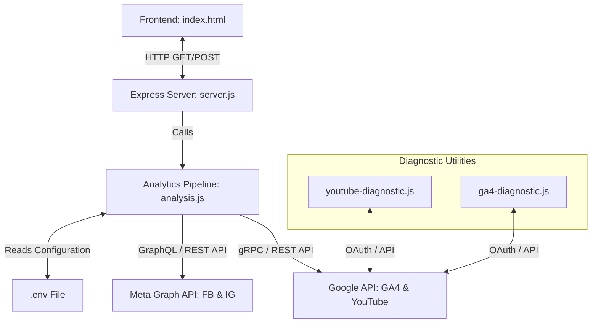
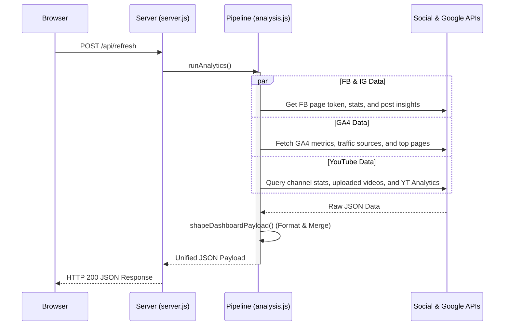

# IntoAEC Analytics Dashboard Project Analysis

The **IntoAEC Social Media Analytics Dashboard** is a unified dashboard designed to pull, aggregate, and visualize performance metrics from multiple digital platforms, including Facebook, Instagram, Google Analytics 4, and YouTube.

---

## System Architecture

The project is structured as a light Node.js Express backend serving a single-page HTML5 frontend that uses Vanilla CSS and Chart.js.

---

## File Breakdown and Modules

### 1. Server Component — [`server.js`](file:///d:/sivaTheGreat/dashboard/server.js)
The core backend server of the application:
- Built using **Express** and supports **CORS**.
- Serves the frontend [`index.html`](file:///d:/sivaTheGreat/dashboard/index.html) statically.
- Exposes two key API endpoints:
  - `GET /api/data`: Returns cached/fresh dashboard data payload.
  - `POST /api/refresh`: Forces a run of the analytics fetcher pipeline and returns the fresh JSON payload.
- Dynamically assigns and switches to alternative ports (3000 to 3010) if the default port is already in use.

### 2. Analytics Pipeline — [`analysis.js`](file:///d:/sivaTheGreat/dashboard/analysis.js)
The data orchestration engine that queries third-party APIs and maps response payloads:
- **Environment Integration:** Loads keys, IDs, and access tokens from [`.env`](file:///d:/sivaTheGreat/dashboard/.env) using `dotenv`.
- **Concurrency Control:** Utilizes `parallelMap` (custom sliding-concurrency implementation) to throttle simultaneous API requests.
- **Facebook / Instagram Graph API:**
  - Authenticates using standard User/Page tokens.
  - Resolves Page tokens automatically to fetch Page Likes, Followers, Post Impressions, Reach, Page Views, and Media insights.
- **Google API Suite:**
  - Configures OAuth2 clients for Google Analytics 4 (GA4) and YouTube Analytics using a client ID, client secret, and refresh token.
  - Fetches 90-day users, sessions, views, bounce rate, top traffic channels, and 365-day top paths (pages) via the GA4 Data API.
  - Resolves YouTube Channel ID via handles, retrieves public channel statistics, page uploads, and 90-day YouTube Analytics reports.

### 3. Frontend Dashboard — [`index.html`](file:///d:/sivaTheGreat/dashboard/index.html)
A modern client-side single-page application (SPA):
- Styling is implemented using native **CSS custom properties** containing structured style tokens, supporting a premium custom palette, glassmorphism shadows, and smooth hover/micro-animations.
- Uses **Chart.js** to visualize performance over time (traffic sources, channel mixes, view metrics).
- Tabs organize views by:
  1. *Overview:* Aggregated cross-platform KPI cards.
  2. *Facebook & Instagram:* Social engagement posts and geographic/gender/age demographic cards.
  3. *Google Analytics:* Web sessions, bounce rate, traffic channels, and top pages.
  4. *YouTube:* Private channel views, subscribers, video uploads, and top videos.

### 4. Diagnostics & Testing
The project contains utility scripts that bypass the Express server to directly validate API scopes and auth configurations:
- **[`youtube-diagnostic.js`](file:///d:/sivaTheGreat/dashboard/youtube-diagnostic.js):** Validates YouTube API credentials and runs mock analytics reports.
- **[`ga4-diagnostic.js`](file:///d:/sivaTheGreat/dashboard/ga4-diagnostic.js):** Displays accounts and properties visible to the Google OAuth credentials.

---

## Data Pipeline Flow

When the user triggers a refresh, the pipeline performs the following actions:

---

## Configuration Requirements — [`.env`](file:///d:/sivaTheGreat/dashboard/.env)

The application depends on the following environment variables:

| Variable | Scope / Purpose | Source |
| :--- | :--- | :--- |
| `PAGE_ID` | Facebook page ID to fetch insights | Facebook Page settings |
| `ACCESS_TOKEN` | Meta User Access Token with page and insights permissions | Meta Developer App |
| `IG_USER_ID` | Instagram Professional Account ID | Meta Graph API / Explorer |
| `YOUTUBE_API_KEY` | Public data querying API Key | Google Developer Console |
| `YOUTUBE_CHANNEL_HANDLE` | YouTube Channel handle (e.g., `IntoAEC`) | YouTube Studio |
| `GA_MEASUREMENT_ID` | GA4 property tracking ID (G-XXXX) | GA4 Data Stream Settings |
| `GA_PROPERTY_ID` | GA4 numerical property ID | GA4 Property Settings |
| `GOOGLE_CLIENT_ID` | OAuth2 application credentials client ID | Google Developer Console |
| `GOOGLE_CLIENT_SECRET` | OAuth2 application credentials client secret | Google Developer Console |
| `GOOGLE_REFRESH_TOKEN` | Long-lived OAuth2 user token for Google APIs | Google OAuth Playground |

---

## Diagnostic Findings & Action Items

> [!WARNING]
> ### 1. Meta API Failures (HTTP 400)
> * **Symptom:** Facebook and Instagram modules return error code 400.
> * **Cause:** The `ACCESS_TOKEN` in [`.env`](file:///d:/sivaTheGreat/dashboard/.env) has been invalidated due to a security session refresh or user password change.
> * **Action Required:** Re-authenticate via the Graph API Explorer, request a new long-lived User Access Token, and update [`.env`](file:///d:/sivaTheGreat/dashboard/.env).

> [!IMPORTANT]
> ### 2. Google Search Console Client Warning
> * **Symptom:** Log warnings indicate: `Failed to fetch GSC properties: Insufficient Permission`.
> * **Cause:** The Google OAuth credentials (`GOOGLE_REFRESH_TOKEN`) lack the Search Console permission scope or the authenticated user account does not own the associated site property.
> * **Action Required:** Regenerate the Google Refresh Token, making sure to select and grant permissions for the Search Console API scopes.
